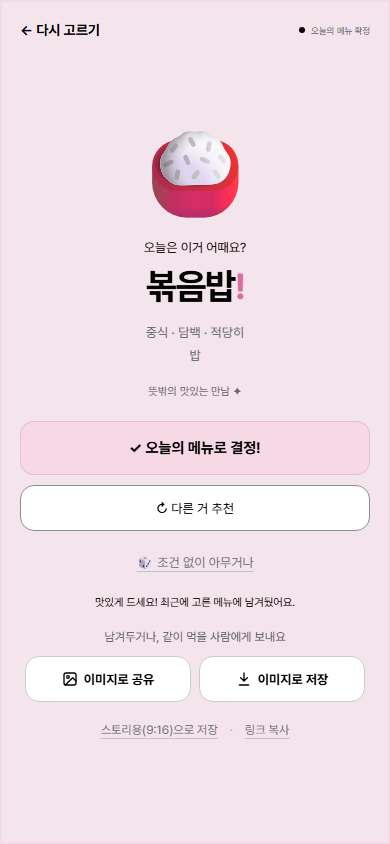
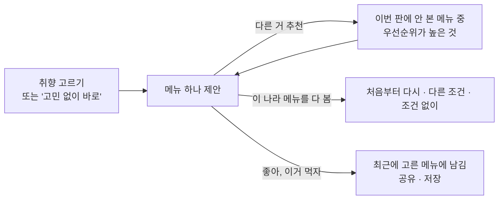

# 추천을 반복해서 써도 쓸모 있게

> 오늘 뭐 먹지? · 메뉴 추천 규칙 · 10월 1일 ~ 2일 · 구현·병합·배포 완료

## 문제를 발견한 계기

- **출발점(제작자의 경험)**
  - "오늘 뭐 먹지?"에서 가장 힘든 건 메뉴의 범주를 고르는 게 아니라, 구체적인 메뉴 하나를 떠올리는 일이라고 봤습니다.
  - 그래서 첫 MVP는 '한식'이 아니라 *순대국밥*, *김치찜* 같은 메뉴 하나를 내밀었습니다.
- **써 보니 생긴 문제**
  - **같은 메뉴가 왕복함:** '다른 거 추천'을 누르면 직전 메뉴 하나만 빼고 다시 골랐습니다. 딱 맞는 메뉴가 하나뿐이면 *김밥 → 된장찌개 → 김밥 → …*처럼 두 메뉴 사이를 오갔습니다.
  - **고른 나라를 벗어남:** 조건을 점수로 더해서, *일식 · 든든하게 · 면*을 골랐는데 크림 파스타, 마라탕이 나왔습니다. '면·든든하게'만 맞는 다른 나라 메뉴가 같은 점수가 됐기 때문입니다.

## 사용자 가치와 범위

- **덜어주려는 수고:** 메뉴를 떠올리는 일. 추천을 몇 번 넘겨도 계속 새롭고 납득되는 후보가 나와야 합니다.
- **최소 입력:** 나라·맛·양·종류 네 가지. 모두 '아무거나'로 둘 수 있고, '고민 없이 바로 골라줘'는 조건 없이 바로 하나를 고릅니다.
- **넣지 않은 것:** 고른 나라에 딱 맞는 메뉴가 없을 때 다른 나라를 권하기. 예를 들어 "중식엔 시원한 메뉴가 없어요 → 일식엔 냉모밀이 있어요" 같은 안내입니다. 다음 검토 아이디어로 남겼습니다.

## 선택과 이유

| 판단할 문제 | 고려한 대안 | 선택 | 이유와 감수한 제약 |
| --- | --- | --- | --- |
| 다음 추천에서 무엇을 뺄까 | 직전 메뉴 하나만 빼기 | **이번 판에 보여준 메뉴를 모두 기억** | 왕복이 사라지고 같은 메뉴가 한 판에 한 번씩만 나옴. 다 보면 자동으로 돌지 않고 사람이 고르게 함 |
| 조건을 어떻게 섞을까 | 맞는 조건 수를 점수로 더하기 | **나라는 고정, 나머지는 우선순위(종류 > 맛 > 양)대로 내려가기** | 나라는 "오늘은 일식"처럼 가장 강한 의도라서 절대 벗어나지 않음. 덜 맞는 메뉴가 나올 때는 어떤 조건이 빠졌는지 보여줌 |
| 메뉴 목록 | 50개 유지 | **129개, 한국에서 점심·저녁으로 흔히 먹는 메뉴 위주** | 애매한 메뉴는 빼고(예: 츠케멘), 비슷한 것은 합침(돈코츠/쇼유 라멘 → 라멘). 실제로 없는 조합(한식+느끼+밥)은 억지로 채우지 않음 |
| 이모지가 없는 메뉴 | 비슷한 이모지로 대신 | **대표 그림 6장을 직접 그리거나 받아서 넣음** | 김밥·떡볶이·국밥·찜은 이모지가 없어서 메뉴가 바로 떠오르지 않았음 |

## 사용자 흐름

- **덜 맞는 메뉴일 때:** "딱 맞는 메뉴는 다 봤어요 · 매콤 조건은 맞지 않아요"처럼 무엇이 빠졌는지 알려줍니다.
- **문구 원칙:** "취향을 바꿔보세요"처럼 사용자에게 취향을 바꾸라고 읽히는 말은 쓰지 않습니다.

## 정보 정책

| 정보 | 처리 위치 | 보관 |
| --- | --- | --- |
| 고른 취향, 이번 판에 본 메뉴 | 화면 상태 | 화면을 닫으면 사라짐 |
| '좋아, 이거 먹자'를 누른 메뉴 | 이 기기의 이 브라우저(localStorage). 메뉴 id·이름·날짜만 | 최근 5개, '기록 지우기'로 삭제 |

추천은 모두 브라우저 안에서 계산합니다. 서버로 보내는 정보는 없습니다.

## 구현 구조

- **메뉴 데이터:** 메뉴마다 나라·맛·양·종류 태그를 붙인 목록이고, 그림이 있는 메뉴만 그림 경로를 가집니다.
- **추천:** 고른 나라 안에서 '맞지 않는 조건'의 조합별로 단계를 나눕니다. 같은 단계 안에서는 무작위이고, 본 메뉴는 제외합니다.
- **문구와 데이터를 함께 지키기:** 메뉴가 100개 아래로 줄면 단위 테스트가 실패해서, "100가지가 넘는" 같은 문구가 틀려지지 않게 했습니다.

## 검증과 남은 질문

| 확인 | 방법 | 결과 |
| --- | --- | --- |
| 한 판에 같은 메뉴가 두 번 안 나옴 | 단위 테스트 | 통과 |
| 고른 나라 밖 메뉴가 절대 안 나옴 | 단위 테스트, 모든 조건 조합 | 통과 |
| 우선순위대로 내려감(양 → 맛 → 종류) | 단위 테스트 | 통과 |
| 메뉴가 사용자에게 납득되는지 | 제작자 사용 | 가설 단계 (실사용 반응은 아직 적음) |

- **다음 검토:** 고른 나라에 딱 맞는 메뉴가 없을 때 다른 나라를 권하기. 같은 조건에서 '다 봤어요'가 자주 나온다는 반응이 생기면 다시 봅니다.
