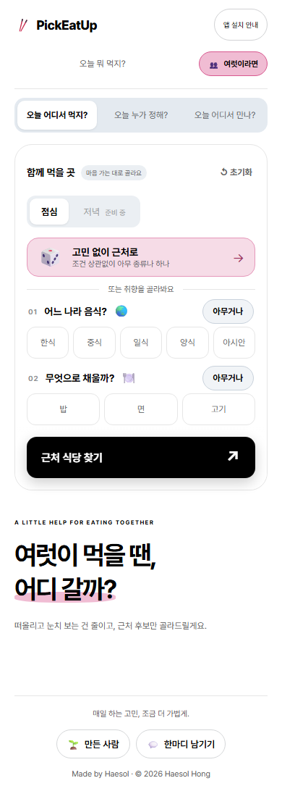
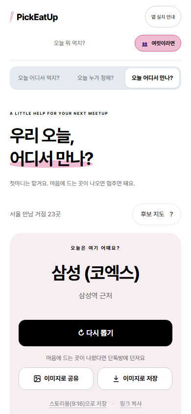
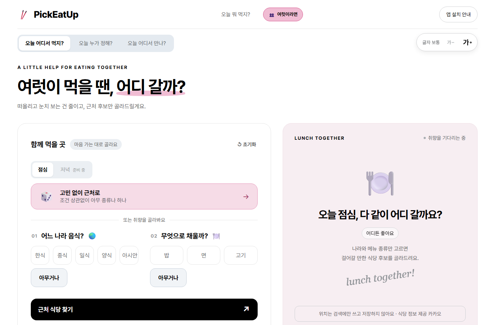
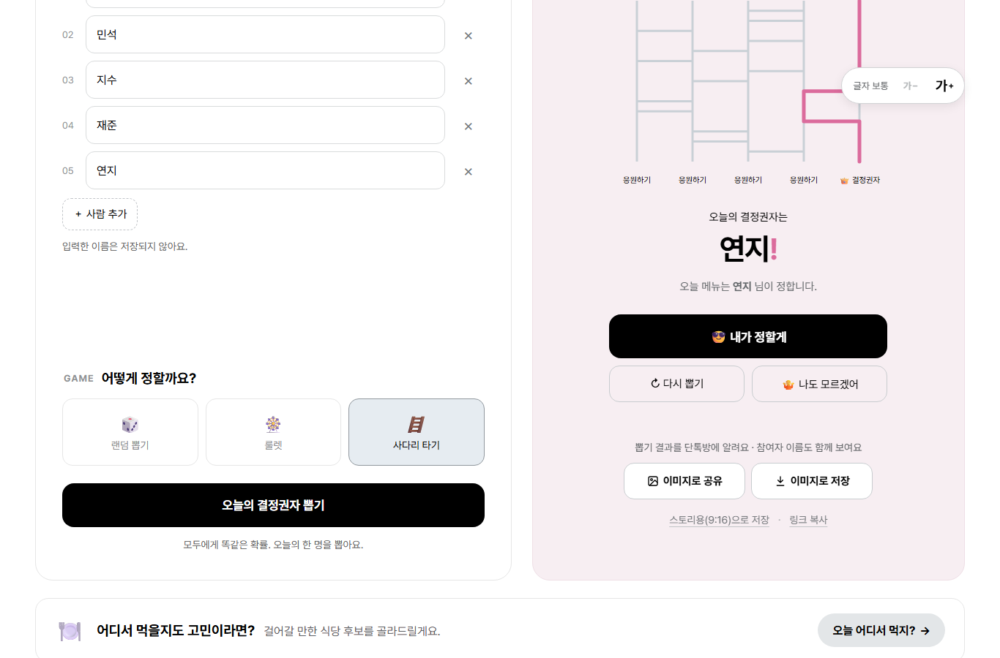
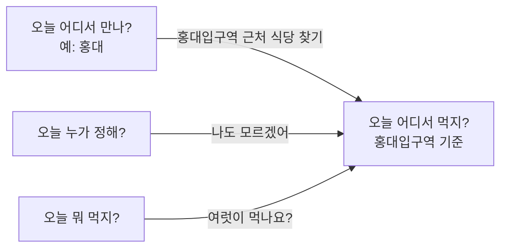

# 여럿이 겪는 서로 다른 결정

> 오늘 어디서 먹지? · 오늘 누가 정해? · 오늘 어디서 만나? · 10월 3일 · 구현·병합·배포 완료

  
  

## 문제를 발견한 계기

혼자 먹을 때는 메뉴 하나가 정해지면 끝납니다. 여럿이면 정할 것이 더 많아지고, 각각 성격이 다릅니다.

- **같이 있는데 어디 갈지 모를 때(예: 회사 점심):** 힘든 건 메뉴 자체보다 누군가 "어디 갈래?"를 떠올리고, 여러 사람 눈치를 보며 먼저 제안하는 일입니다.
- **각자 다른 곳에서 올 때(예: 친구 약속):** 장소를 찾는 것보다 서로를 배려해 첫 제안을 하는 일이 어렵습니다.
- **서로 결정을 미룰 때:** 무엇을 정할지가 아니라 누가 정할지가 문제입니다.

이 세 가지는 제작자가 직접 겪는 상황에서 출발한 가설입니다.

## 기능을 나눈 기준: 무엇을 정해주는가

| 기능 | 정해주는 것 | 단위 | 전제 상황 |
| --- | --- | --- | --- |
| 오늘 뭐 먹지? | 메뉴 | 요리 하나 | 누구든. 혼자 먹을 때 가장 잘 맞음 |
| 오늘 어디서 먹지? | 식당 | 매장 유형 → 근처 가게 3~5곳 | 이미 같이 있는 여럿 |
| 오늘 어디서 만나? | 만날 동네 | 서울 거점 역 | 각자 다른 곳에서 오는 여럿 |
| 오늘 누가 정해? | 정할 사람 | 사람 한 명 | 위 셋 중 무엇에든 붙는 한 단계 위의 결정 |

새 기능은 이 표로 먼저 확인합니다. 정해주는 대상이 기존 기능과 같으면 새 탭을 만들지 않고 그 기능 안의 선택지로 넣습니다. 예를 들어 룰렛·사다리는 '누가 정해?' 안의 방법으로 넣었습니다.

## 오늘 어디서 먹지? (근처 식당 후보)

**결정 도구가 아니라 후보를 내미는 도구**로 만들었습니다. 가게를 자세히 알아보는 건 어차피 사람들이 직접 합니다.

| 판단할 문제 | 선택 | 이유 |
| --- | --- | --- |
| 무엇을 고르게 할까 | 나라와 밥/면/고기 **두 가지만**. '고민 없이 근처로' 한 번으로도 시작 | 혼자 메뉴 추천(네 가지)보다 질문을 줄임 |
| 결과의 단위 | 메뉴가 아니라 **매장 유형**(예: 족발·보쌈) | 여럿이 합의하는 단위는 "어떤 집에 갈지"라서 메뉴보다 한 단계 넓음. 기준은 "그 이름으로 간판을 다는 집이 있는가"(피자 ≠ 파스타, 족발·보쌈은 하나) |
| 결과의 양 | 유형 하나 + 가게 3~5곳, 버튼은 '이 중 랜덤 1곳'과 '다른 종류로' | 비교하고 따지게 만드는 정보(리뷰 링크, 필터)는 넣지 않음 |
| 위치 | 검색할 때만 묻고, 현재 위치 · 근처 역 · 직접 입력 중 언제든 바꿀 수 있게 | 앱에 들어오자마자 권한을 요구하지 않음. "회사 말고 ○○역 근처"가 흔한 경우라 근처 역을 바로 고르게 함 |
| 점심/저녁 | 점심만 열고 저녁은 '준비 중' | 저녁은 술집·안주 유형을 따로 기획해야 함. 데이터에는 미리 구분해 둠 |

**실제 데이터로 확인하고 고친 점**
- **처음 문제:** 카카오 키워드 검색은 그 메뉴를 팔기만 하는 가게도 돌려줬습니다. 족발로 찾으면 빈대떡집이, 피자로 찾으면 술집·빵집이 섞였습니다.
- **정렬:** 결과를 정확도순으로 받고, 거리순 정렬은 우리가 다시 했습니다. 강남역 800m 안 피자집이 0곳에서 11곳으로 늘었습니다.
- **걸러내기:** 가게의 카카오 업종이 그 유형일 때만 남기고, 점심에는 술집 업종을 뺐습니다.
- **후보가 적을 때:** 반경 800m에서 3곳이 안 되면, 같은 조건의 다른 유형을 하나 더 찾습니다. 그래도 부족하면 1.2km로 넓히고 "조금 멀어요"를 표시합니다.

## 오늘 어디서 만나? (서울 거점 제안)

- **결과:** 장소 하나와 기준 역, 그리고 '다시 뽑기' 하나뿐입니다. 제외 목록, 인원, 모임 유형은 묻지 않습니다.
- **반복 허용:** 매번 독립적으로 뽑아서 같은 곳이 또 나올 수 있습니다. '잠실 → 홍대 → 잠실'이면 "그냥 잠실 가자"로 정할 수 있게 한 것입니다.
- **후보 23곳:** 운영자가 고른 목록입니다. 인기 순위나 최적의 중간 지점이 아닙니다.
- **뽑는 방식:** 다섯 지역을 각 20%로 먼저 뽑고, 그 안에서 한 곳을 고릅니다. 역을 모두 같은 확률로 뽑으면 후보가 많은 지역이 더 자주 나오기 때문입니다.
- **후보 지도:** 어떤 곳이 후보인지 투명하게 보여주는 안내입니다. 결과에 늘 붙이면 다시 비교하게 되므로 따로 엽니다. 외부 지도 API 없이 그렸습니다.
- **아직 없는 기능:** '출발역으로 좁혀줘'(각자 이동 시간 제한)는 비활성으로만 보여줍니다.

## 오늘 누가 정해? (결정권자)

- **같은 확률:** 이름을 2명 이상 넣고, 랜덤 뽑기·룰렛·사다리 중 하나로 한 명을 뽑습니다. 모두 같은 확률이고, 다시 뽑으면 같은 사람이 또 나올 수 있습니다.
- **'나도 모르겠어':** 뽑힌 사람이 막막하면 누르는 버튼입니다. 처음에는 메뉴 추천으로 갔지만, 여럿이 모인 상황이라 **근처 식당 후보**로 가도록 바꿨습니다.
- **이름은 저장하지 않습니다.**

## 기능끼리 잇기

같은 대상을 정하는 기능은 없지만, 실제로는 이어서 씁니다.

- **만날 곳 → 식당:** 결과의 기준 역이 식당 찾기의 위치가 됩니다. 링크에는 장소 id만 담고 좌표는 받지 않으며, 위치 권한도 묻지 않습니다.
- **아직 잇지 않은 것**
  - 메뉴 추천 결과 → '이 메뉴 파는 근처 식당': 혼밥 메뉴와 매장 유형을 잇는 기획이 필요합니다.
  - 만날 곳 → 저녁 식당: 저녁 모드가 먼저 필요합니다.

## 정보 정책

| 정보 | 필요한 이유 | 처리 위치 | 보관 | 외부 전달 |
| --- | --- | --- | --- | --- |
| 현재 위치 좌표 | 근처 식당·역 검색 | 화면 상태 → 우리 서버 → 카카오 | 저장하지 않음 | 검색할 때 카카오 로컬 API로 전달 |
| 직접 입력한 장소 | 위치를 정하기 | 화면 상태 → 우리 서버 → 카카오 | 저장하지 않음. 서버 로그에는 글자 수만 남김 | 카카오로 전달 |
| 결정권자 이름 | 뽑기 | 화면 상태 | 저장하지 않음 | 공유할 때만 링크·그림에 담김 |
| 카카오 가게 정보 | 후보 보여주기 | 화면 상태 | 저장하지 않음(운영정책상 캐시 제한) | 없음 |

"서버에 저장하지 않는다"는 말이 "외부로 보내지 않는다"는 뜻은 아닙니다. 위치는 검색할 때 카카오로 전달됩니다.

## 구현과 비용

- 카카오 REST 키는 서버에서만 읽습니다. 화면은 카카오를 직접 부르지 않고 우리 서버를 거칩니다.
- 검색 1회에 카카오를 보통 2~3번, 근처에 가게가 적으면 최대 9번 부릅니다.
- 하루 한도(키워드 검색 10만 건, 카카오 디벨로퍼스 쿼터 화면 기준)를 넘으면 "오늘 쓸 수 있는 검색을 다 썼어요"를 보여줍니다.
- 한 사람이 쿼터를 다 써버리지 않도록, 방문자마다 10분에 30번으로 제한합니다([공개 서비스의 안전장치](07-safety.md)).
- 자동 테스트는 카카오를 부르지 않는 가짜 응답으로 돌립니다.

## 검증과 남은 질문

| 확인 | 방법 | 결과 | 확인 못 한 범위 |
| --- | --- | --- | --- |
| 업종 필터가 엉뚱한 가게를 거르는지 | 실제 강남역 응답 사례를 단위 테스트에 넣음 | 통과 | 지역마다 카카오 분류의 차이 |
| 위치 거부 → 직접 입력, 근처 역으로 바꾸기 | 브라우저 테스트 | 통과 | 실제 휴대폰의 권한 팝업 |
| 지역별 균등 추첨, 사다리 경로 일대일 | 단위 테스트 | 통과 | |
| 매장 유형 단위가 합의에 도움이 되는지 | | 가설 | 실제 점심 자리에서의 사용 |

- **남은 한계**
  - 백반·찜찌개는 카카오에 전용 분류가 없어서, 결과 범위가 넓은 편입니다.
  - 만날 곳은 서울 거점만 다루고, 이동 시간은 계산하지 않습니다.
