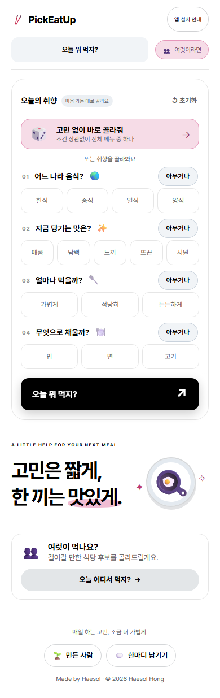
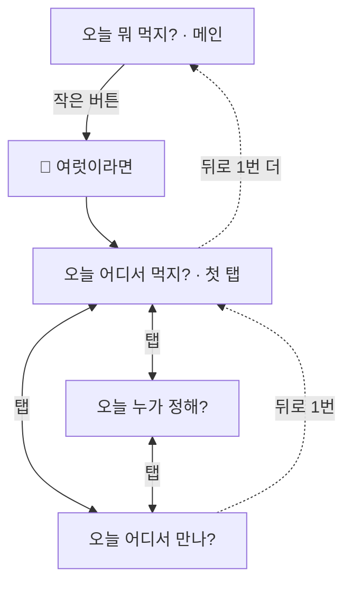

# 기능이 늘어도 단순한 첫 화면

> 메뉴 구조 · 입력 부담 · 휴대폰 배치 · 뒤로가기 · 10월 2일 ~ 3일 · 구현·병합·배포 완료

## 문제를 발견한 계기

- **기능이 늘면서:** 상단에 *오늘 뭐 먹지? · 오늘 누가 정해? · 점심 회식 · 오늘 어디서 만나?* 네 개가 나란히 놓였습니다. 이 앱의 중심인 '오늘 뭐 먹지?'가 여러 개 중 하나로 흐려졌습니다.
- **휴대폰에서**
  - 갤럭시(360px)에서 네 번째 질문이 화면 밖으로 밀렸습니다.
  - 결정권자 화면에서는 세 명만 넣어도 뽑기 버튼이 잘렸습니다.
  - 여럿이 기능의 탭을 오가다 뒤로가기를 누르면, 오갔던 탭을 하나씩 되돌아갔습니다.

## 원칙

- **'오늘 뭐 먹지?'가 메인입니다.** 하나를 끝까지 고르지 않더라도, 메뉴를 떠올리는 수고를 가장 직접 덜어주는 기능이기 때문입니다.
- **'혼자'라는 말은 쓰지 않습니다.** 첫 화면에서 "혼자예요, 여럿이예요?"를 묻는 건 모두에게 선택을 하나 더 늘립니다. 메뉴에 '혼자'라고 붙이면 혼자 먹는 사람에게 꼬리표처럼 느껴질 수 있습니다.
- **여럿이 쓰는 기능은 작은 '👥 여럿이라면' 아래에 둡니다.** 여럿이일 때는 정할 게 많아서, 한 단계 더 들어가는 정도는 괜찮다고 봤습니다.
- **새 탭은 기존 기능이 정해주지 않는 것을 정할 때만 만듭니다.** 기준은 [기능 구분 표](02-eating-together.md#기능을-나눈-기준-무엇을-정해주는가)입니다.

## 선택과 이유

| 판단할 문제 | 고려한 대안 | 선택 | 이유 |
| --- | --- | --- | --- |
| 여럿이 기능을 어디에 둘까 | ① 상단에 네 개 나란히 ② '혼자 · 여럿이' 두 탭 | **메인 '오늘 뭐 먹지?' + 작은 '여럿이라면' 버튼** | ②는 메인 기능 이름이 사라지고 '혼자' 꼬리표가 생김. 크기·색·모양을 달리해서 두 번째 메인이 아니라 덧붙은 선택지로 읽히게 함 |
| '여럿이라면'을 누르면 | 기능을 고르는 중간 화면 | **바로 '오늘 어디서 먹지?'** | 여럿이일 때 가장 자주 쓸 기능을 먼저 열고, 나머지는 질문 탭으로 |
| '점심 회식'이라는 이름 | 그대로 | **'오늘 어디서 먹지?'** + 점심/저녁 탭 | '회식'은 상황을 너무 좁힘. 질문 이름은 '오늘 ~?' 형식으로 통일 |
| 휴대폰에서 '아무거나' 위치 | 선택지 다음 줄 | **질문 제목 줄 오른쪽** | 360px에서 질문마다 한 줄씩 늘던 것을 없애 네 질문이 한 화면에 들어옴 |
| 휴대폰 결과 | 고르는 화면 아래에 이어서 | **결과를 별도 화면으로**, 뒤로가기로 닫기 | 결과를 보려고 스크롤하지 않아도 됨 |
| 여럿이라면 탭 뒤로가기 | 탭 이동마다 기록이 쌓임 | **뒤로가기 1번이면 첫 탭(오늘 어디서 먹지?), 2번이면 여럿이라면 밖으로** | 탭을 오간 횟수만큼 되돌아가면 앱에서 나가지 못하는 느낌. 첫 탭으로 한 번 돌아가는 건 자연스러움 |
| 데스크톱 작은 글씨 | 그대로 | **한 단계 키우고, 글자 크기 3단계 버튼** | 노트북에서 안내 문구가 잘 안 읽힘 |
| 화면 아래쪽 | 화면마다 다른 문구 | **모든 화면 같은 푸터**, 화면별 안내는 줄 위로 | 어디서든 '만든 사람 · 한마디 남기기'를 같은 자리에서 찾게 |

## 사용자 흐름

## 정보 정책

- **글자 크기 선택:** 이 브라우저에만 저장합니다. 데스크톱에서만 보입니다.
- **탭 이동 기록:** 탭을 오간 기록은 이 탭의 세션 저장소(sessionStorage)에만 둡니다. 탭을 닫으면 사라집니다.

## 검증과 남은 질문

| 확인 | 방법 | 결과 |
| --- | --- | --- |
| 360·390px에서 네 질문이 한 화면에 들어옴 | 브라우저 테스트 (360×780) | 통과 |
| 세 명 입력 시 뽑기 버튼이 첫 화면 안 | 브라우저 테스트 | 통과 |
| 탭을 네 번 오간 뒤 뒤로 1번 = 첫 탭, 2번 = 밖 | 브라우저 테스트 | 통과 |
| 320~1920px에서 가로 스크롤 없음 | 브라우저 테스트 | 통과 |

**보류한 것: 휴대폰 글자 크기와 짧은 탭 이름**
- **지금 상태:** 휴대폰 탭은 세 칸에 "오늘 어디서 먹지?"를 넣느라 두 줄로 접힙니다. 작은 안내 글씨도 남아 있습니다.
- **나왔던 안:** 짧은 이름(식당 / 결정권자 / 만날 곳)과 최소 글자 크기 12px.
- **보류한 이유**
  - 앱 안에 글자 크기 조절 모드를 둘지 아직 정하지 않았습니다.
  - 짧은 이름이 바로 와닿지 않았습니다.
  - 예쁘게 맞추려면 화면 전체를 다시 손봐야 하는 일입니다.
- **다음 단계:** 글꼴 비교와 함께 다시 봅니다.

**검토 중: 휴대폰 하단 메뉴바**
- 탭으로 넘어가게 하면 스크롤을 줄일 수 있습니다.
- 다만 하단 탭은 '오늘 뭐 먹지?'와 '여럿이라면'을 같은 층위로 만들어, 위 원칙과 부딪힙니다. 그래서 두 방향을 함께 시안으로 볼 예정입니다.
