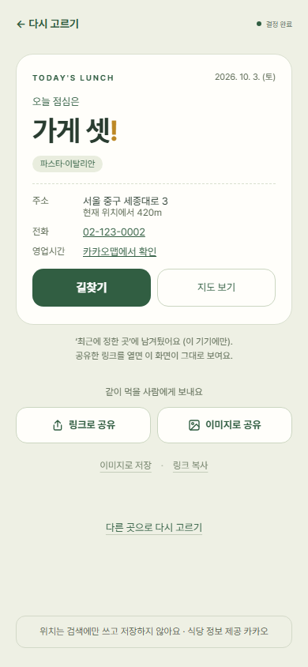
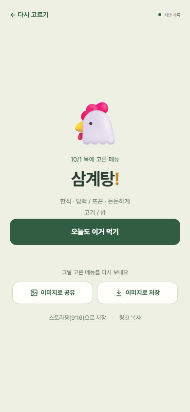
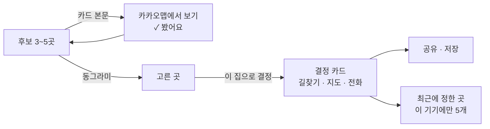
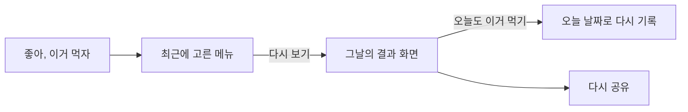

# 추천 이후의 결정과 재사용

> 둘러보기 · 고르기 · 정하기 · 기억하기 · 다시 보기 · 10월 3일 · 구현·병합·배포 완료

  
  

*두 화면은 색을 바꾸기 전에 찍었고, 가게는 테스트용 예시 데이터입니다.*

## 문제를 발견한 계기

'오늘 어디서 먹지?'는 근처 식당 후보를 내밀었지만, 그다음이 비어 있었습니다.

- **둘러본 뒤 고를 방법이 없었습니다.** 카드를 누르면 카카오맵으로 넘어가기만 하고, "이 집으로 할래"를 표시할 곳이 없었습니다.
- **어느 가게를 봤는지 구분되지 않았습니다.**
- **결과가 남지 않았습니다.** 다들 매번 스크린샷을 찍지는 않으니, 정한 곳이 흩어지거나 잊혔습니다.
- **혼자 고른 메뉴도 같은 문제:** '좋아, 이거 먹자'를 누른 메뉴가 기록돼도, 눌러서 다시 볼 수 없었습니다.

## 사용자 가치와 범위

"후보를 보고 → 하나 고르고 → 정하고 → 같이 먹는 사람에게 보내고 → 나도 기억한다"를 한 흐름으로 잇습니다. 앱은 여전히 **후보를 내미는 앱**이고, 최종 결정은 사람이 합니다.

## 선택과 이유

| 판단할 문제 | 선택 | 이유와 감수한 제약 |
| --- | --- | --- |
| 카드를 누르는 동작 | **카드 본문 = 카카오맵 보기, 오른쪽 동그라미 = 고르기** | 한 번 누르는 동작에 두 뜻이 섞이면 지도를 보려다 실수로 고르게 됨 |
| 본 가게 표시 | 카카오맵을 연 카드에 '✓ 봤어요' | 지금 화면에서만 유지. 화면을 끄면 사라진다고 미리 안내 |
| '이 중 랜덤 1곳' | **고르기까지만**, '이 집으로 결정'은 사람이 누름 | 정해주는 앱이 아니라 후보를 내미는 앱 |
| 무엇을 기록할까 | **정한 것만 남는다** | 고르는 중(후보 목록, 봤어요, 동그라미)은 화면에서만. 정한 곳만 '최근에 정한 곳'에, 공유 링크는 보낸 곳에 남음 |
| 기록 위치 | **로그인 없이 이 기기의 이 브라우저에만, 최근 5개** | 계정을 만들게 하면 선택이 하나 더 늘어남. 대신 "이 기기에만 저장돼요"와 '기록 지우기'를 함께 보여줌 |
| 식당 기록에 담을 값 | **날짜·식사·가게 이름·유형·장소 id만**. 주소·전화는 저장 안 함 | 주소와 전화는 바뀔 수 있음. 카카오 운영정책은 사용자 환경 개선 외 목적의 캐시를 금지하고, 캐시하면 최신으로 유지하도록 요구함. 누르면 카카오맵에서 최신 정보를 봄 |
| 영업시간 | **카카오맵 링크로 대신** | 카카오 로컬 API에는 영업시간·메뉴·사진이 없음. 가져오려면 크롤링이 필요해서 범위 밖 |
| 혼자 고른 메뉴 기록 | **식당과 같은 규칙**(정한 것만, 최신순 5개, 같은 날 같은 메뉴는 맨 위로) | 두 기록의 동작이 달라 헷갈리지 않게 |
| 최근 메뉴를 누르면 | **그 메뉴의 결과 화면을 그날 날짜와 함께 다시 띄움** + '오늘도 이거 먹기' | 공유 카드 페이지로 보내면 내 기록이 남에게 보내는 화면처럼 보임. 지난 기록이라 '다른 거 추천'은 숨김 |

## 사용자 흐름

## 정보 정책

| 정보 | 처리·저장 위치 | 보관·삭제 | 외부 전달 |
| --- | --- | --- | --- |
| 봤어요 · 고른 곳 | 화면 상태 | 화면을 끄면 사라짐 | 없음 |
| 최근에 정한 곳 | 이 브라우저(localStorage) | 최근 5개, '기록 지우기' | 없음 |
| 최근에 고른 메뉴 | 이 브라우저(localStorage) | 최근 5개, '기록 지우기' | 없음 |
| 공유한 결정 | 링크 안에 담김(서버 저장 없음) | 링크를 가진 사람이 언제든 엶 | 받은 사람에게 전달. [공유](05-sharing.md) 참고 |

로그인이 없어서 생기는 한계도 있습니다. 다른 브라우저, 아이폰의 홈 화면 앱과 사파리, 시크릿 모드에서는 기록이 보이지 않습니다. 사이트 데이터를 지우면 사라집니다.

## 검증과 남은 질문

| 확인 | 방법 | 결과 |
| --- | --- | --- |
| 기록 5개 유지, 같은 날 같은 곳 중복 정리, 저장 항목 제한 | 단위 테스트 | 통과 |
| 망가진 저장값은 빈 목록으로 | 단위 테스트 | 통과 |
| 봤어요 → 고르기 → 결정 → 새로고침해도 남음 | 브라우저 테스트 | 통과 |
| 다시 보기 → 뒤로가기로 닫힘 → 오늘도 이거 먹기 | 브라우저 테스트 | 통과 |

- **다음 검토:** 고르던 후보를 이어서 보기(당일 한정). 피드백이 나오면 봅니다.
