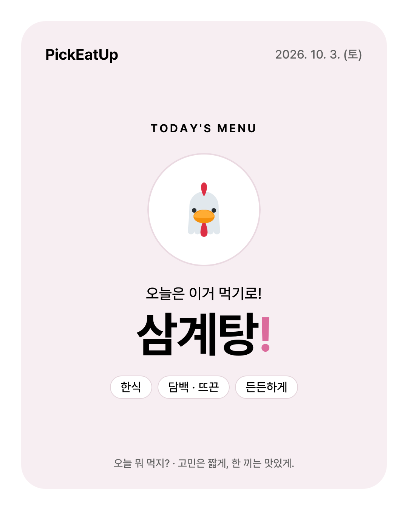
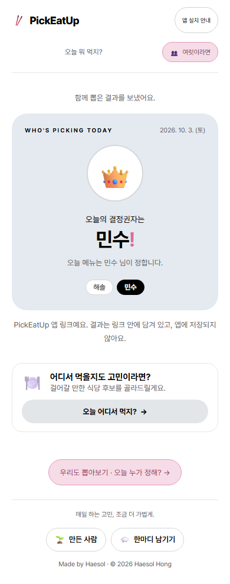
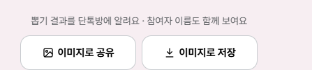
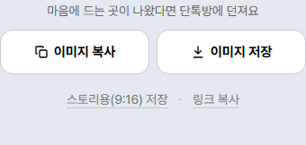
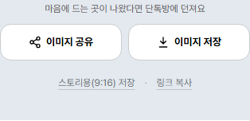
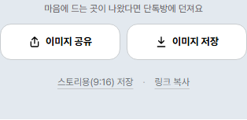
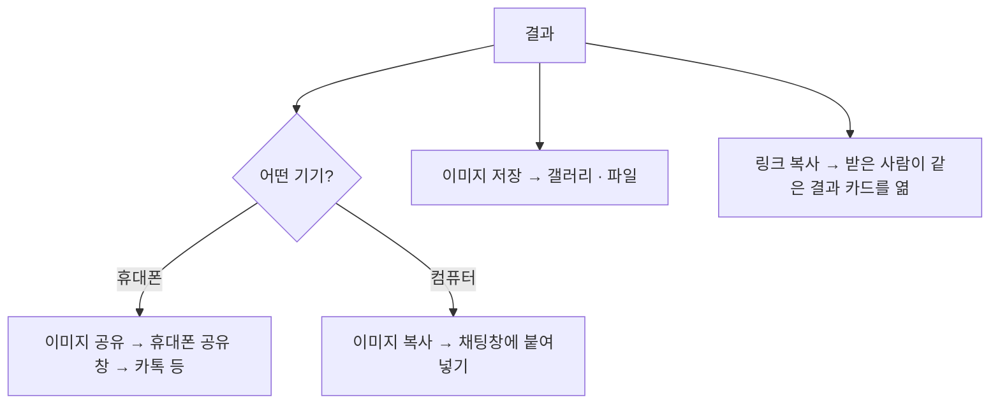

# 함께 쓰기 위한 공유

> 네 기능의 결과 공유 · 이미지와 링크의 우선순위 · 10월 3일 · 구현·병합·배포 완료 · 갤럭시에서 직접 확인

  
  

## 문제를 발견한 계기

한 사람이 앱에서 결과를 뽑으면, 그걸 단톡방에 알리려고 매번 스크린샷을 찍었습니다. 스크린샷에는 버튼과 메뉴가 같이 찍힙니다. 받은 사람은 무슨 앱인지, 다시 볼 수 있는지 알 수 없습니다.

## 버전별로 바꾼 것 (배포 후 휴대폰으로 직접 써 보며 고침)

| 버전 | 바꾼 것 | 계기 |
| --- | --- | --- |
| 1 | 네 기능 결과 아래에 같은 공유 블록. **공유하기**(링크) · **이미지로 저장**(카톡용 4:5 기본, 스토리용 9:16 선택) | 스크린샷 수고 없애기 |
| 2 | 저장은 바로 저장, 공유 문구는 한 번만 | 저장이 공유 창을 열었음. 카톡에 "제목 - 본문"으로 같은 문장이 두 번 보였음 |
| 3 | **그림 먼저 공유**, 링크는 보조. 긴 링크는 서버 저장 없이 압축 | 카톡에 400자가 넘는 주소가 그대로 보였음 |
| 4 | 버튼 이름을 기기별 동작대로. 휴대폰은 '이미지 공유'(휴대폰의 공유 아이콘), 컴퓨터는 '이미지 복사' | 같은 자리의 버튼이 기기마다 다른 일을 해서 헷갈림 |

   
  
  
  

*위: 이전 버튼 · 아래: 컴퓨터 / 안드로이드 / 아이폰*

## 선택과 이유

| 판단할 문제 | 고려한 대안 | 선택 | 이유와 감수한 제약 |
| --- | --- | --- | --- |
| 오늘 뭐 먹지?는 언제 공유할까 | 추천이 나오자마자 | **'좋아, 이거 먹자' 뒤에만** | 추천만 받은 상태는 아직 정한 것이 아님. 정한 것만 남기는 기록 규칙과 맞춤 |
| 결과를 어디에 담을까 | ① 서버에 저장하고 짧은 주소 ② 카카오톡 공유 SDK | **링크 안에 결과를 담음(서버 저장 없음)**, 형식에 버전을 붙임 | ①은 참여자 이름이나 카카오 가게 정보를 서버에 둬야 함. 불필요한 저장이고 카카오 운영정책과도 걸림. ②는 카톡에서만 주소를 숨기고 슬랙·문자에서는 그대로 보임 |
| 링크가 길어지는 문제 | 짧은 주소(서버 저장) | **그림을 먼저 보내고, 링크는 압축** | 그림은 주소 없이 결과만 전함. 한글 이름이 링크에서 9자씩 차지하던 것을 2.7자 수준으로 압축(결정권자 7명: 약 420자 → 약 105자). 식당 링크는 전화번호를 빼서 약 150~190자 |
| 식당만 다르게 | 모두 그림 먼저 | **식당은 링크 먼저** | 받은 사람이 카카오맵·길찾기를 눌러야 해서 링크가 쓸모 있음 |
| 기기별 동작 | 휴대폰도 복사로 통일 | **휴대폰은 공유 창, 컴퓨터는 복사**. 이름과 아이콘을 동작대로 | 휴대폰에서 카톡으로 그림을 보내는 익숙한 길은 공유 창(갤럭시에서 확인). 컴퓨터 공유 창에는 카톡·슬랙이 거의 없음. 휴대폰 버튼은 그 휴대폰의 공유 아이콘을 써서 '복사'와 다르게 보이게 함 |
| 결정권자 공유 | 이름 빼기 | **참여자 이름 모두 포함, 결정권자 강조** | 함께 뽑았다는 것이 보여야 '모두에게 같은 확률'이 납득됨 |
| 그림 크기 | 9:16 고정 | **기본 카톡용 4:5**, 스토리용 9:16 선택, 링크 미리보기 1200×630 | 지금 주 용도는 카톡 단톡방 |

## 사용자 흐름

## 정보 정책

| 정보 | 담기는 곳 | 보관 | 공유 범위 |
| --- | --- | --- | --- |
| 메뉴·만날 곳 결과 | 링크(메뉴·장소 id와 날짜) | 서버에 없음 | 링크를 받은 사람 |
| 결정권자와 참여자 이름 | 링크와 그림 | 서버에 없음 | 링크·그림을 받은 사람. 화면에 "참여자 이름도 함께 보여요"라고 미리 안내 |
| 식당 정보(이름·유형·주소·거리·좌표) | 링크와 그림 | 서버에 없음. 식당 그림은 캐시하지 않음 | 받은 사람. '현재 위치'는 받는 사람에게 '보낸 사람 위치'로 바꿔 보여줌 |

**링크 조작 대비**
- 형식이 앱이 만든 것과 다르면 카드 대신 안내를 보여줍니다. 없는 메뉴, 참여자에 없는 결정권자, 너무 많은 인원 같은 경우입니다.
- 카카오맵·길찾기·전화 링크는 링크 안의 값을 그대로 쓰지 않습니다. 장소 id와 검사한 값으로 다시 만들어서, 다른 사이트로 보낼 수 없습니다.

## 구현 구조

- **같은 문구 하나:** 결과 카드 화면, 저장 그림, 링크 미리보기가 같은 문구를 씁니다. 세 곳의 내용이 서로 어긋나지 않습니다.
- **그림은 서버에서 그림:** 한글 이름이 빠지지 않게 전체 글꼴 파일을 함께 배포합니다.
- **아이폰:** 웹 페이지가 사진첩에 바로 저장할 수 없어서, 공유 창의 '이미지 저장'을 안내합니다.
- **예전 링크도 계속 열림:** 링크 형식을 바꿔도 이전 버전을 계속 읽습니다.

## 검증과 남은 질문

| 확인 | 방법 | 결과 | 확인 못 한 범위 |
| --- | --- | --- | --- |
| 링크 왕복, 조작된 링크 거절, 압축 길이 | 단위 테스트 | 통과 | |
| 컴퓨터에서 이미지 복사 → 클립보드에 그림 | 브라우저 테스트 | 통과 | |
| 휴대폰 환경에서 '이미지 공유'로 보임 | 브라우저 테스트(터치) | 통과 | |
| 이미지 공유 → 카톡에 그림만 감, 저장 → 갤러리 | 제작자 갤럭시 실기기 | 확인됨 | 아이폰 실기기, 카톡 인앱 브라우저 |

- **받아들인 것:** 공유 링크의 이름 글자는 누구나 마음대로 넣을 수 있습니다. 장난 카드를 만들 수는 있지만, 다른 사이트로 보내는 링크는 만들 수 없어서 그대로 뒀습니다.
