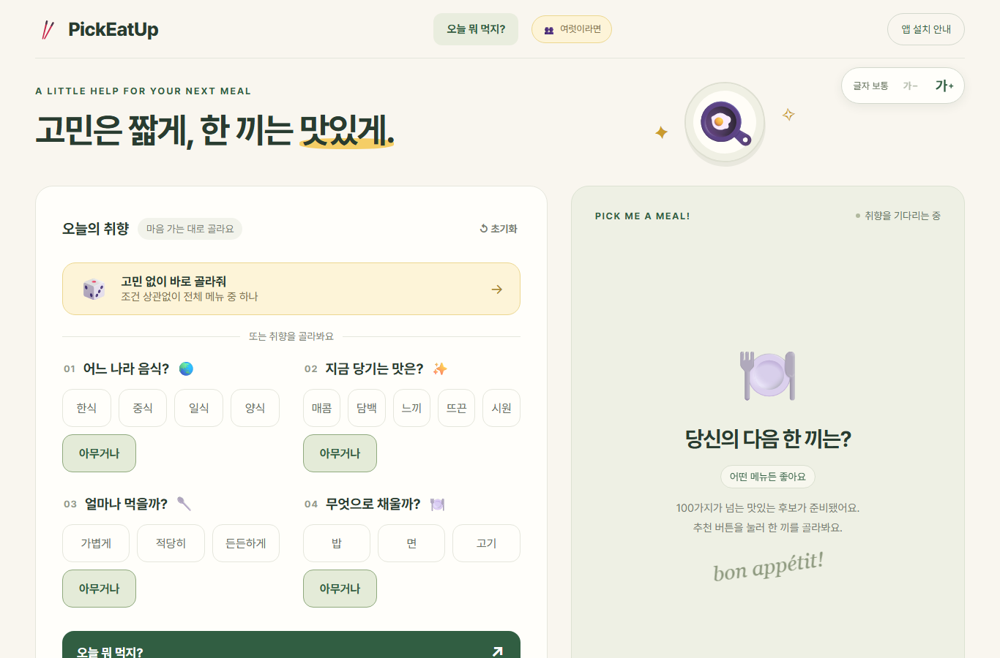
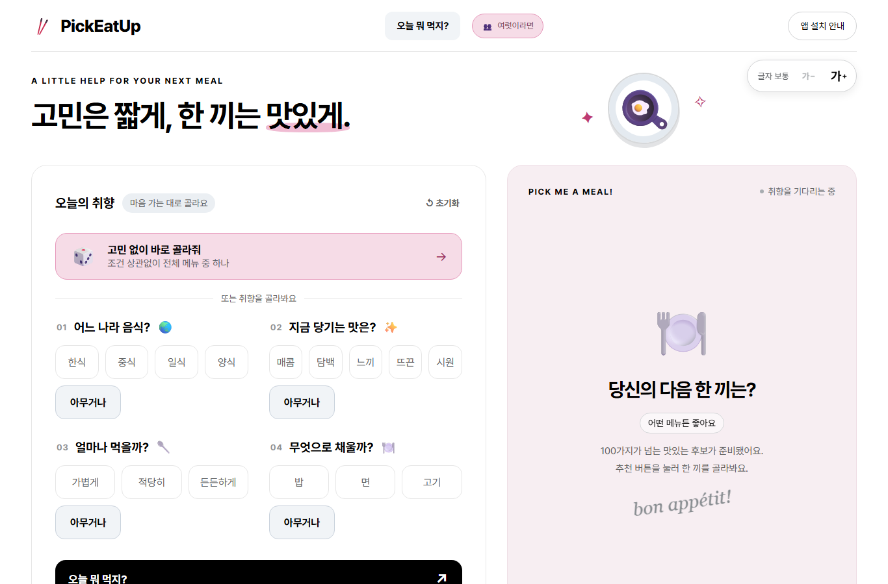
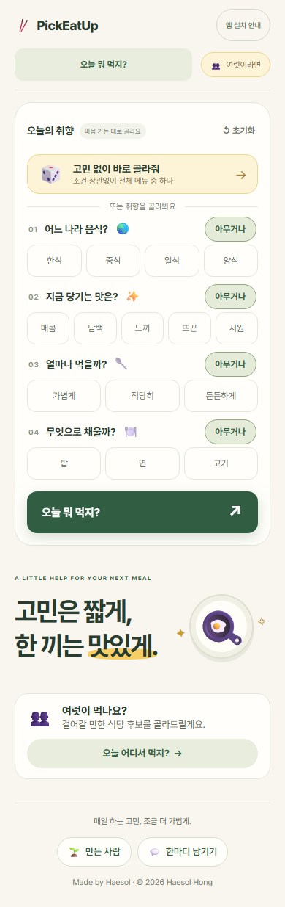
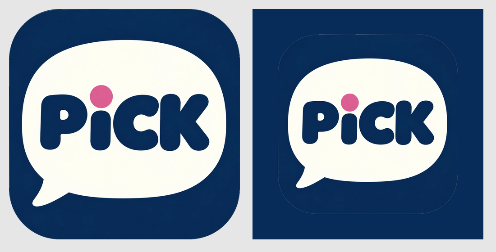

# 서비스의 인상과 의견 창구

> 색 · 그림 · 아이콘 · 문구 · 로그인 없는 한마디 보드 · 10월 2일 ~ 3일 · 구현·병합·배포 완료

| 이전 (크림 + 초록 + 노랑) | 지금 (흰 바탕 + 검정 + 분홍 · 장미색) |
| --- | --- |
|  |  |
|  |  |

## 색

### 문제를 발견한 계기

- **흔한 조합과 겹침:** 연한 크림 바탕에 깊은 초록과 겨자색 포인트는 요즘 생성형 디자인에서 자주 보이는 조합과 겹쳤습니다.
- **화면이 흐릿함:** 흰 카드와 크림 바탕이 잘 구분되지 않았습니다.
- **앱의 성격과 안 맞음:** 이 앱은 고를 것을 줄여주는 앱이라 깔끔하고 또렷한 인상이 맞다고 봤습니다.

### 고른 과정

색만 바꾼 안부터 모서리·버튼·카드 모양까지 바꾼 안까지, 같은 세 화면(첫 화면, 추천 결과, 식당 결정)에 칠해서 휴대폰과 데스크톱 크기로 비교했습니다. 직접 색을 넣어 보는 비교 보드도 만들었습니다.

| 안 | 인상 | 결과 |
| --- | --- | --- |
| 흰 바탕 + 남색 | 차분하고 깔끔함 | 남색·하늘색 조합이 업무용 웹서비스의 기본 파랑처럼 보임 |
| 코랄 핑크 | 차분하고 깔끔하며 한 톤으로 이어짐 | 핑크 포인트의 산뜻함은 최종안에 남김 |
| 토마토 레드 | 트렌디하고 단호함 | 매장 예약 서비스를 떠올리게 함 |
| 옐로 + 차콜 | 트렌디하고, 노랑이 눈에 잘 들어오고 편안함 | 메신저 앱을 떠올리게 함 |
| **흰 바탕 + 검정 + 분홍빛 결과 칸 + 푸른 회색 면 + 장미색 포인트** | 깔끔하면서 산뜻함 | **선택.** 제작자가 비교 보드에서 직접 만든 조합을 조금 다듬음 |

### 선택과 이유

- **따뜻한 분홍 결과 칸 + 차가운 푸른 회색 면:** 온도 차이 덕분에 칩·탭·메뉴 표시가 바탕에서 또렷하게 떨어져 보입니다. 회색을 분홍 쪽으로 맞춘 안은 요소가 바탕에 묻혔습니다.
- **장미색은 포인트에만:** '여럿이라면' 버튼, 랜덤 카드, 제목 밑줄, 결과의 '!'에만 씁니다. 흰 바탕과의 대비가 약 3.8:1이라 작은 글씨에는 쓰지 않습니다.
- **결정 완료와 누를 수 없는 상태를 나눔:** 결정 완료는 분홍, 아직 누를 수 없는 버튼은 회색입니다. 둘 다 누를 수 없지만 뜻이 반대입니다. 결정 완료를 회색으로 두면 분홍 결과 칸 위에서 탁해 보였습니다.
- **같은 색으로 맞춘 곳:** 룰렛·사다리, 공유 이미지, 설치 앱 색도 같은 색으로 맞췄습니다.

## 그림과 아이콘

- **메뉴 그림:** 이모지가 없는 한식(김밥·떡볶이·국밥·찜)은 직접 그리거나 받은 그림으로 대신했습니다. 메뉴가 바로 떠올라야 하기 때문입니다.
- **젓가락 (앱 안의 작은 아이콘)**
  - '집다(pick)'라는 뜻을 보여주면서 음식도 떠올리게 합니다.
  - 한국 사람이 매일 쓰는 도구이고, 메뉴 129개 중 69개가 한식입니다.
  - 상단 로고와 룰렛 가운데에 쓰고, 색은 장미색입니다.
- **앱 아이콘**
  - 말풍선 안에 PICK을 크게 넣어, 대신 골라주는 앱이라는 점을 강조했습니다.
  - i의 점은 장미색이라 앱 포인트와 이어집니다.
  - **바탕은 의도적으로 네이비입니다.** 검은 바탕은 답답하고, 홈 화면에서 잘 안 보이고, 너무 어두운 인상을 줄 수 있습니다.
  - 앱 아이콘이 앱 안 화면과 나란히 보일 일은 적습니다. 그래도 네이비 · 흰 말풍선 · 장미색 점이라 따로 놀지 않고, 오히려 산뜻하고 세련돼 보입니다.

## 문구

- **'오늘 ~?' 질문형으로 통일:** 오늘 뭐 먹지? / 오늘 어디서 먹지? / 오늘 누가 정해? / 오늘 어디서 만나?
- **'혼자'라는 말은 쓰지 않음:** 혼자 먹는 사람에게 꼬리표처럼 느껴질 수 있습니다.
- **사용자에게 바꾸라고 하지 않음:** 결과가 덜 맞을 때도 "취향을 바꿔보세요" 대신, 어떤 조건이 맞지 않는지 알려줍니다.
- **소개 문구:** 소개는 '고민을 조금 덜어주는, 작은 사이드 프로젝트.'처럼 가볍게 쓰고, 본문에서 실제로 덜어주는 수고를 설명합니다.

## 의견 창구: 로그인 없는 한마디 보드

| 판단할 문제 | 선택 | 이유 |
| --- | --- | --- |
| 어디에 둘까 | **모든 화면 아래 공통 푸터의 '만든 사람 · 한마디 남기기'** | 결정 기능의 상단 선택지를 늘리지 않음 |
| 형식 | 분류·별점·답글·로그인 없이 쪽지 한 장 | 반응과 '이런 곳도 넣어 주세요'를 정리해서 보내야 한다는 부담을 줄임 |
| 내 글 지우기 | 계정 없이 삭제용 비밀번호 | 비밀번호는 원문 대신 되돌릴 수 없는 형태(scrypt + salt)로만 저장 |
| 저장소 | 공유 저장소(Upstash Redis) | 서버 메모리나 각자의 브라우저로는 모두가 보는 보드를 만들 수 없음 |
| 공개할 연락처 | GitHub 프로필만 | 이메일은 표시하지 않음 |

**정보 정책**
- **저장하는 것:** 닉네임, 글, 작성 시각, 비밀번호를 바꾼 값입니다.
- **횟수 제한:** IP 원문 대신 짧게 보관하는 HMAC 값으로 셉니다. 작성은 1시간에 5번, 삭제는 10분에 10번입니다.
- **환경 분리:** 미리보기 배포에서 쓴 글은 실제 서비스 글과 다른 키 공간에 저장됩니다.
- **화면에 안내:** "닉네임과 쪽지는 모두에게 공개돼요."

## 검증과 남은 질문

- **화면:** 색 변경 전후를 휴대폰·데스크톱 크기 스크린샷으로 비교했습니다. 모든 페이지에서 가로 넘침이 없는지 확인했습니다.
- **방명록:** 작성·조회·삭제와 틀린 비밀번호 거절을 테스트했고, 실제 저장소로도 미리보기 배포에서 확인했습니다.
- **글꼴(보류):** 지금은 Pretendard입니다. 비교 목업에 쓴 Noto Sans KR이 더 또렷해 보여서, 나란히 비교한 뒤 정합니다.
- **휴대폰 하단 메뉴바(검토 중):** [단순한 첫 화면](03-simple-first-screen.md)에서 이어서 봅니다.
